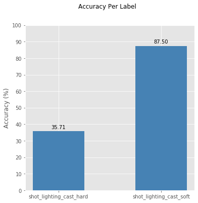
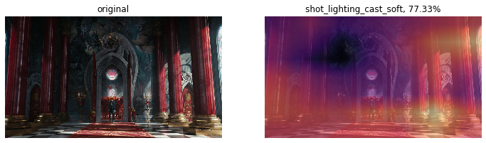
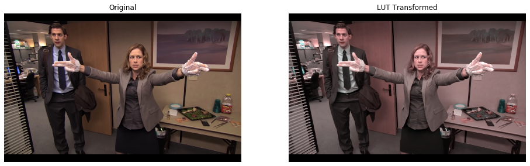

# FastAI2 Extensions
> This library is a collection of utility functions for a variety of purposes that fit right into the `fastai2` ecosystem. It's broadly divided into 3 modules -- _interpret_ , _augment_ , and _inference_ . 


## Install

`pip install fastai2_extensions`

## Interpretation

##### `ClassificationInterpretationEx`

Extends fastai's [`ClassificationInterpretation`](https://github.com/fastai/fastai2/blob/master/fastai2/interpret.py#L48) to plot model confidence and per-label accuracy bar graphs. It also adds some convenience to grab filenames based on these confidence levels.

This part of the library is currently suitable for Softmax classifiers only. Multilabel support will be added soon.

```python
from fastai2.vision.all import *
from fastai2_extensions.interpret.all import *
```

```python
learn = load_learner('/Users/rahulsomani/Desktop/shot-lighting-cast/fastai2-110-epoch-model.pkl')
```

```python
interp = ClassificationInterpretationEx.from_learner(learn)
```


```python
plt.style.use('ggplot')
interp.plot_accuracy()
```





```python
interp.plot_label_confidence()
```


##### `GradCam`

The `GradCam` object takes in 3 args:
* `learn`: a fastai `Learner`
* `fname`: path to the image file to draw the heatcam over
* `labels`: list of labels to draw the heatmap for. If `None`, draws for the highest predicted class

There's quite a few plotting options. For more options, see the docs.

```python
import PIL
fname = '../assets/imgs/alice-in-wonderland.jpg'
PIL.Image.open(fname).resize((550,270))
```


```python
gcam = GradCam(learn, fname, None)
gcam.plot(full_size=True, plot_original=True, figsize=(12,6))
```





```python
gcam = GradCam(learn, fname, ['shot_lighting_cast_hard', 'shot_lighting_cast_soft'])
gcam.plot(full_size=False, plot_original=False, figsize=(12,4))
```


##### Comparing Multiple Models

`compare_venn` lets you compares 2 or models trained evaluated on the same dataset to inspect model agreement. If you only input 2 or 3 models, then you can also see Venn Diagrams for the same.

For simplicity, I'm using the same model here with smaller versions of the validation set to display this functionality.

```python
interp1 = ClassificationInterpretationEx.from_learner(learn1)
interp2 = ClassificationInterpretationEx.from_learner(learn2)
interp3 = ClassificationInterpretationEx.from_learner(learn3)
interp1.compute_label_confidence()
interp2.compute_label_confidence()
interp3.compute_label_confidence()
```


```python
%%capture
fig,common_labels = compare_venn(
    conf_level=(0,99),  interps=[interp1,interp2],
    mode='accurate',
    return_common=True, return_fig=True,
    set_color='tomato'
)
```

```python
fig
```


```python
%%capture
fig,common_labels = compare_venn(
    conf_level=(0,99),  interps=[interp1,interp2,interp3],
    mode='accurate',
    return_common=True, return_fig=True,
    set_color='tomato'
)
```

```python
fig
```


## Augmentation

`ApplyPILFilter`, not surprisingly, lets you apply one or more `PIL.ImageFilter`s as a data augmentation.

There's also a convenience function `read_lut` which lets you read in a LUT file (commonly found with `.cube` extensions), and construct a `PIL.ImageFilter.Color3dLUT` to apply as a transform.

The idea place for this in a fastai2 pipeline is as an `item_tfms` as it's a lossless transform and can be done right after reading the image from disk. A full example is shown in the docs.

```python
from fastai2_extensions.augment.pil_filters import *
```

```python
lut   = read_lut('../assets/luts/2strip.cube')
fname = '../assets/imgs/office-standoff.png'

img_raw  = PILImage.create(fname)
img_filt = ApplyPILFilter(lut,p=1.0)(fname, split_idx=0)
```

```python
%%capture
fig,ax = plt.subplots(nrows=1, ncols=2, figsize=(16,6))
show_tensor = lambda x,ax: ToTensor()(x).show(ctx=ax)

show_tensor(img_raw,ax[0])
show_tensor(img_filt,ax[1])

ax[0].set_title('Original')
ax[1].set_title('LUT Transformed')
```

```python
fig
```





## Export

Convenience wrappers to export to `ONNX`. <br>
Other frameworks will be added soon.

##### ONNX

```python
#hide_output
from fastai2_extensions.inference.export import *
```

```python
torch_to_onnx(learn.model,
              activation   = nn.Softmax(-1),
              save_path    = Path.home()/'Desktop',
              model_fname  = 'onnx-model',
              input_shape  = (1,3,224,224),
              input_name   = 'input_image',
              output_names = 'output')
```

    Loading, polishing, and optimising exported model from /Users/rahulsomani/Desktop/onnx-model.onnx
    Exported successfully


```python
path_onnx_model = '/Users/rahulsomani/Desktop/onnx-model.onnx'
fname = '../assets/imgs/odyssey-ape.png'
```

```python
from onnxruntime import InferenceSession

session = InferenceSession(path_onnx_model)
x = {session.get_inputs()[0].name:
     torch_to_numpy(preprocess_one(fname))} # preprocessing - varies based on your training
session.run(None, x)
```


    [array([[0.6942669 , 0.30573303]], dtype=float32)]


